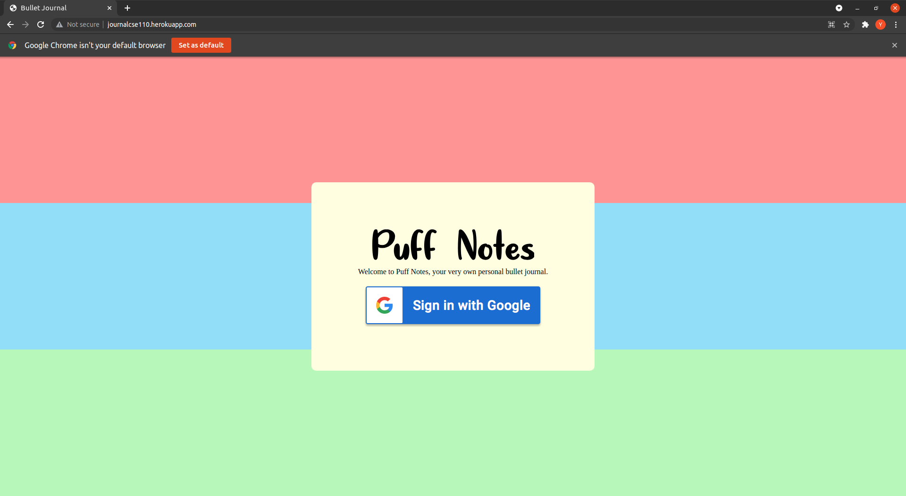
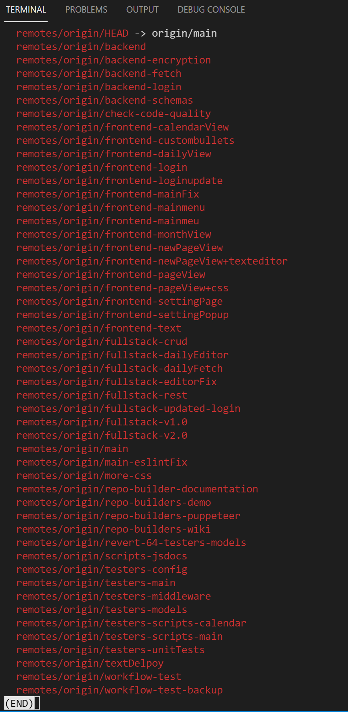

# cse110-sp21-group14
This project will be Team 14's bullet journal! The Powell Puff Gang will create a bullet journal themed around The Powerpuff Girls series from Cartoon Network.

Link to our team member introductions [here](admin/team.md)

Link to our Public Video [here](https://www.youtube.com/watch?v=7kJBJ_yHrN0)

# Puff Notes
* Link to the user guide [here](admin/user-guide.md)
* Link to a mascot and logo [here](https://github.com/cse110-sp21-group14/cse110-sp21-group14/tree/main/admin/branding)
* Link to the website [here](http://journalcse110.herokuapp.com/)

# Repo Navigation
Our repo contains three main sections:
1. /admin - which contains all administrative documentation related to the Agile process.
2. /source - which contains all code to build Puff Notes.
3. /specs - which contains documentation related to design and the initial brainstorming process.

Some important directories:
* Link to our meeting minutes in our raw google document [here](https://docs.google.com/document/d/1Ol9hfNjOAM7VSLkzM7LW5DiJMwhpanS-ZufHaiNX_m4/edit), and all meeting minutes formatted in MarkDown in our repo [here](https://github.com/cse110-sp21-group14/cse110-sp21-group14/tree/main/admin/meetings).
* Link to our 6 ADRs [here](https://github.com/cse110-sp21-group14/cse110-sp21-group14/tree/main/specs/adrs) that guided us through our project's implementation process.
* While designing, we kept in mind these user stories [here](https://github.com/cse110-sp21-group14/cse110-sp21-group14/tree/main/specs/users) to help solve their problems.

# CI/CD and Documentation

* In our pipeline, we have automatic JSDoc documentation created for all .js files written. This documentation is linked [here](https://github.com/cse110-sp21-group14/cse110-sp21-group14/wiki/JSDocumentation) in our project wiki.
* ESLint also runs on push to ensure that the code being committed follows our style guide - link [here](https://github.com/cse110-sp21-group14/cse110-sp21-group14/wiki/Style-Guide).
* Unit tests driven by Jest and Puppeteer also run at the same time to ensure that newly commited code doesn't interfere with existing approved code.

For more details about the pipeline, the full documentation is linked [here](admin/cipipeline/phase1.md). To view a demo of the pipeline, a video link is [here](https://github.com/cse110-sp21-group14/cse110-sp21-group14/blob/main/admin/cipipeline/phase1_checkpoint2.mp4) to download.

Additional documentation was created throughout our project:
* Link to initial Starting Pitch [here](https://docs.google.com/presentation/d/1FfdShEVqnbVHkbO_MD2MfeiusTWybDkg7Jkx2SU8flg/edit#slide=id.p)
* Credits for Third-Party API and tutorials [here](https://docs.google.com/document/d/1IdVgWcgWRZYHBi5ORug7zJ4QmYH1AxhRbgPfunS0dDU/edit)
* Link to Editorjs [here](https://editorjs.io/)
* Link to initial brainstorming via Miro [here](https://miro.com/app/board/o9J_lJcx7N0=/)
* Link to initial wireframes via Figma [here](https://www.figma.com/file/qvMOaWu1RFGLdaPKKiIrAD/Wireframe-for-Bullet-Journal?node-id=0%3A1)
* Link to documentation for the REST API written by Stephen Montes De Oca [here](https://docs.google.com/document/d/1j3DD6C7CQiZlxhDtlqLQMEjPpexy1j_NuitMEchZSkA/edit?usp=sharing)

# Repo setup/Repo Build setup/Deployment guide
The CI/CD pipeline in general works like this: 
1. To develop new features, create a new branch titled `<role-taks>`. For example, if someone were on the frontend team and wanted to implement a habit tracker, then their development branch would be titled `<frontend-habit-tracker>`. Previous branches that we've worked on follow this format: 
   * 
   * These branches are proof of all the branches we've developed new features on, and our continued iteration of the product on separate branches.
2. Create a corresponding GitHub issue to reflect what task is being worked on. 
3. In development, each commit message would follow the form of "\<verb in imperative form\> \<task name\> \<any extra details\>". For example, for a new file titled "empty.txt" to be added, we'd have a commit message called "add empty.txt".
4. Once everything is correct and works as expected, then a pull request is created to main, linking that initial issue to the pull request.
5. The CI/CD team will then manually review the code, and once approved, will merge to main, which runs the workflow again on main - ensuring that all code doesn't have conflicts with existing code. 
6. The web app, deployed by heroku, will be deployed on each update to main - which will update the website. 
7. All done!

# Testing
* For Puff Notes, many tests were based on e2e testing with Puppeteer, and unit testing with Jest. Because these two worked together so well, we used them together in our testing framework.
  * All CRUD operations tested via e2e testing (For Journals and Calendar)
  * Unit tests written for correct information gathering and storing into our database
  * Unit tests written for encryption + decryption

To test, create a branch titled `testers-<testing item>`, and write tests there. the workflow, when ran, will run tests located in `./source/testing`.
However, because of an issue with Google OAuth, and how GitHub actions runs an older version of OAuth(v1.0), the tests will not run the same as they would on your local machine(which runs v2.0). Because of this, we had to separate some tests because of their inability to bypass the v1.0 OAuth login. Tests were ran successfully on local, and are stored in `testers-main` and `testers-scripts-calendar`.
