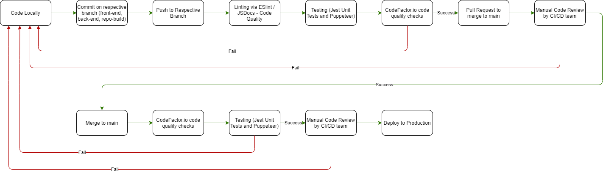

# Pipeline Phase I Diagram

# Status for pipeline
Our pipeline will function with two major steps, with substeps in between:
 1. Dev branch approval
 2. Main branch approval

For our process going forward, we chose to have two major steps like this to ensure that new code has no problems on the developmental branch, and that it does not conflict with any code on the existing main branch. The Powell Puff Gang (Team 14), when developing new code, will go through a specific series of steps. First, before creating code, developers must create a GitHub issue related to their task, and develop their code on a separate branch. This branch must be named \<teamName-task\>. For example, if the front-end team were working on a calendar view, then that branch would be called “front-end-calendar-view”. By dividing up these tasks in this way, we can ensure that we can test frequently, and that one task gets finished entirely at a time. This also allows for continuous work for the testing and CI/CD team, and allows the developers to continue working at their own pace. The GitHub issue is only resolved when the CI/CD team manually reviews and approves all tests related to the task.

Code is to be written in respective development branches, depending on which group of developers is responsible for a given task. Once code is deemed completed by development, then that code is to be committed to that branch with the syntax (\<action in imperative form\> \<item\>). For example, if code were committed to fix a bug related to database entry, then the respective files would be committed with the message “fix database issue.”

Once code is pushed to the development branch, our workflow (Team 14 Powell Puff Gang's approval workflow) will run, executing the linting phase via ESLint, create documentation for coe via JSDoc, and run unit testing via Jest.

We chose ESlint to lint because it has easy integration in VSCode, which is our team’s primary editing tool. At the same time, the developer will generate javascript documentation using JSDocs. JSDocs has easy integration in VSCode as well, and generates documentation for files and functions in the form of a markdown file, which will be stored in /source/documentation. To generate this documentation, the developer will implement function descriptions in comments similar to the examples on their website ([Link to website here](https://jsdoc.app/about-getting-started.html)). Jest unit tests will be run on push, with basic tests written by the developer to test expected behavior, and extensive test cases written by our testers. Jest is optimal for our group, as it allows for running multiple tests at once quickly, and because it already has support for MongoDB, which is what we will be primarily using. If any of the tests fail, the testers will alert the CI/CD team and code developers about what tests failed. Developers will then fix those issues, and the pipeline will start over in the event of failure. If the tests run were successful, then the code moves to the next stage in the pipeline.

Once pushed, our CI/CD team will check CodeFactor.io to view any issues, and if there are any apparent issues brought up by the external code quality app, the team will let the developer know what needs to be changed, and they will make a decision about what needs to be done. 

Once everything has passed the automated tests in the workflow, the developers will initiate a pull request to main, where then the CI/CD team will manually review the code. Upon approval, the branch will merge to main, and we will run the above again, without documentation generation via JSDoc and linting via ESlint. CodeFactor.io will be checked again after we have merged with main, and testing will be run again. This way, we can be sure that there are no conflicts with the existing main branch. Once all this is approved, then that bit of code can be finalized for the final production build.

Our GitHub repo will utilize a yml file titled approval-workflow.yml to help guide the build process. This will be a guideline to detail the processes that need to happen for our pipeline on push. On pull requests, the CI/CD team will manually review the checks that have happened, and approve the merge, and the workflow will be run once again. If everything is good, then the CI/CD team will review the code for a final check, and finalize the code.

~~Our team plans on integrating e2e testing via Cypress once we have more exposure with the topic. After the week 8 Lab, we will be more familiar with writing tests and begin writing tests with the Jest and Cypress framework.~~

(As of 5/22/21):
Our team has chosen to integrate puppeteer for our E2E test, since it has easy support with Jest unit testing. By having this run at the same time as Jest, we can test as if a real user were using our web app as intended.

# Video Demonstration
Video is located in admin/videos/CICD_Pipeline_Phase_1.mp4. Or you can click [here](admin/cipipeline/phase1.mp4)
