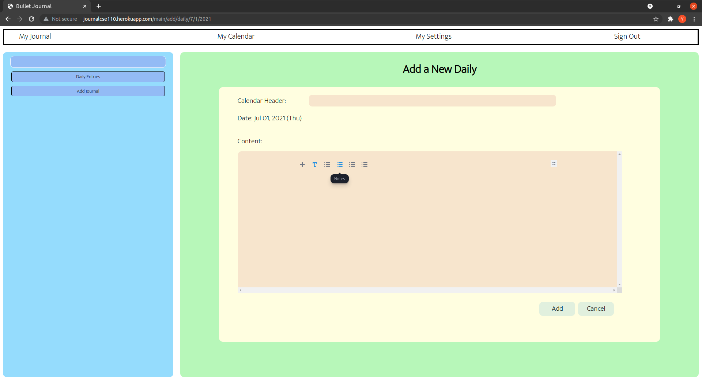
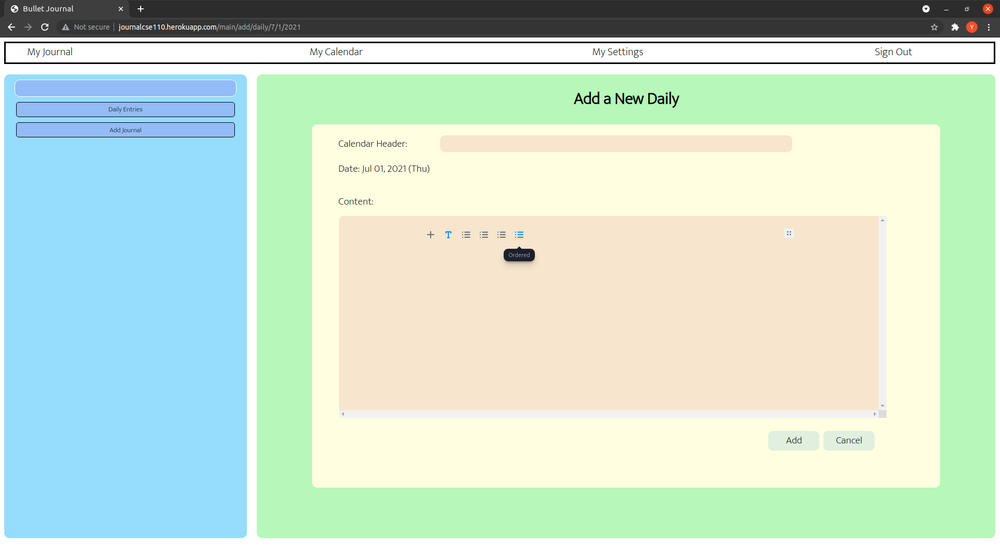
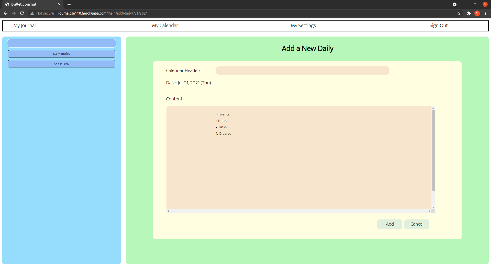
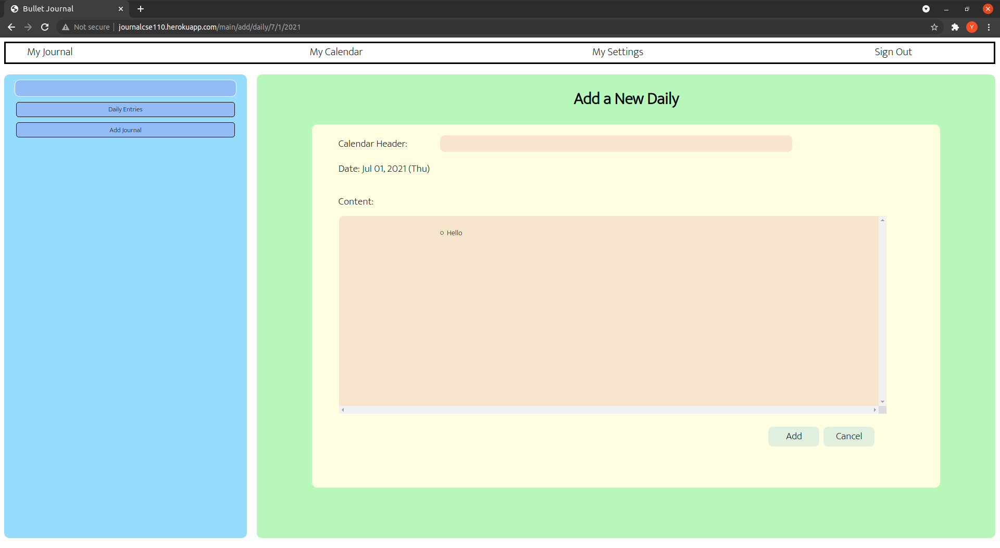
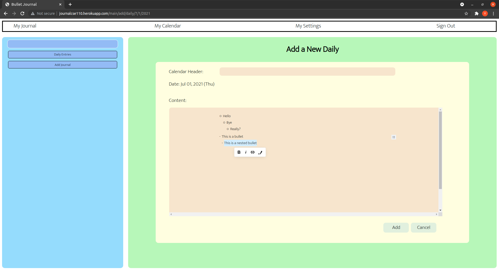

# PPG User Guide

### 1. **Login Page**

You will first reach the Login page when they type in the URL of the Puff Notes Website, which looks like this:

To sign in, click the Google logo in the center and login with a Google account that has already been created. This will ensure that your data is secure, and that only you has access to your data.

Once the user has successfully logged in, they will be taken to the main page as seen below.

There is a navigation bar at the top of the page with four buttons **My Journal**, **My Calendar**, **My Settings** and **Sign Out**. Each of these buttons has a specialized section that will be covered below.
  

### 2. **My Journal**

2.1 Concepts of Journals and Pages

You can add bullet entries under the **My Journal** page. To store your entries journals will hold pages, and those pages will store your bullets.

Journals don't need details about the content, but it has clear structure to navigate pages efficiently.

Pages can then be added under the journal it belongs to. It includes more information about the journal users want to keep track of - a title, a date, and the actual content.
  

2.2 Add/ View/ Delete a Journal

To add a new journal, click **Add Journal** on the left and type in the journal name inside of the flesh color box. Click 'add', and the new journal will show up on the left.

To view an existing journal, click the desired journal, and you will see all pages that the journal contains on the right panel.

To delete an existing journal, click the **Delete** button beside the journal that you want to delete.
  

2.3 Add/ View/ Delete a Page

To add a new page, first decide which journal it belongs to. Then, click the **Add Page** button beside that journal. You will then see a input form on the left. You can only check if they are at the right journal from the Journal Title (The example shows "CSE 130", meaning that they are at CSE 130 Journal.)

Fill in the Page Title and add any notes into Content. You can add in regular paragraph text, or customize which bullets you want to use by clicking the + next to your insertion cursor. You can select one of three options: Events, Notes, and Tasks.

Event bullets are for time sensitive bullets, Notes are for general bullets, and tasks are for bullets to be completed.

Once finished, click **Add** to add the page.

To view an existing page, click the name of the page on the left. Users will see the page content on the right.

To delete an existing page, click the **Delete** button on the right of that page.
  

2.4 EditorJS\
EditorJS is the text editor used in Puff Notes to document your notes. It has 4 different bullets types, and other the features as well. The four different bullet types are shown below.

Here are how the bullets look like\

Our bullets can also be nested together. This can be done by first choosing the type of bullet you want by either pressing the + button, or tabbing on the editor space.

\
In order to nest bullets, you must hit tab once again. This will cause the following

\
You can nest even more bullets if you desire. 

\

In order to exit the nested list, you must hit enter until the bullet goes away.

You can also modify text by highlighting a particular line. It is important that you only do this once you have written everything down first

\

### 3. **My Calendar**

3.1 Monthly View

To access the monthly view, click the **My Calendar** button on the naviagtion tab. Once there, you will see a monthly calendar where they can go to different months by toggling the triangles button besides its title.

Each grid has a number at the top left that corresponds to the date it represents. Today's grid is outlined in dark blue, while grids containing the daily entries are filled with blue. The titles of daily entries are also attached to the grids. By clicking these titles, you can access the daily view, which is explained below.

  

3.2 Add a New Daily Entry

To add a daily entry, you should first decide which date the entry will be tied to. 

You should first click the selection box and select the year and month. 

After clicking the **Search** button on the right, a list of dates in that year and month would be displayed on the page. Users can then scroll down to the date and click the **Add** button on the right to add a new daily entry.

  

3.3 View/ Edit/ Delete Daily Entry

To view an existing daily entry, click the **Edit** button besides the date of that daily entry.

You can then edit the daily entry and click the **Save** button to save their updates.

To delete a daily entry, click the **Delete** button - you should see it that it changes back to the **Add** button, meaning there is no daily entry at that date anymore.

  

### 4. **My Settings**

Under the **My Settings** page, you can then customize the font size. Puff Notes also provides a light mode (default) and a dark mode (only black and white).

  

### 5. **Sign Out**

To finish up, click the **Sign Out** button on the far right on the navigation bar to log out of Puff Notes.
