# PPG User Guide

### 1. **Login Page**

Users will first reach the Login page when they type in the URL of PPG.

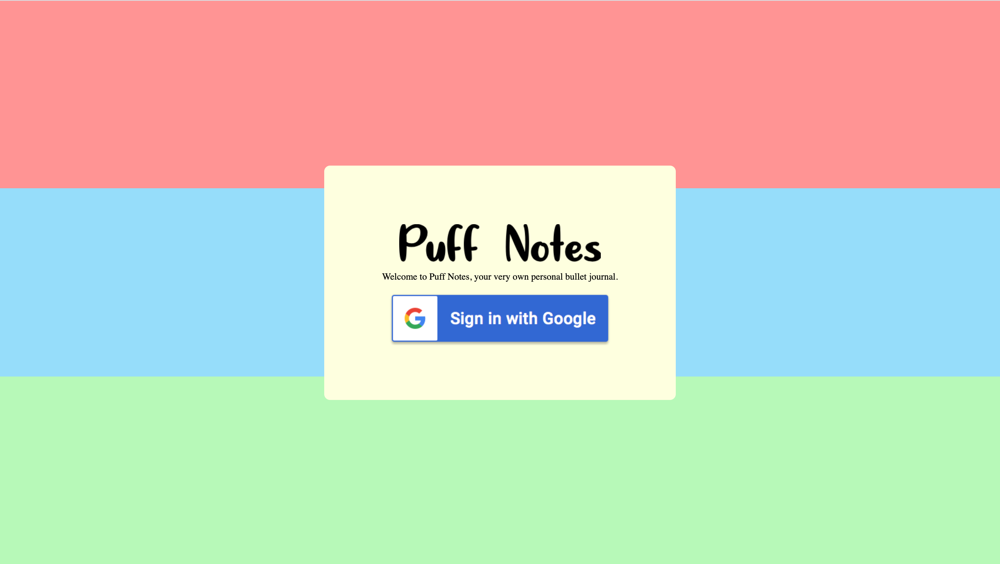

Click the Google logo in the center and login with Google account that has already been created.

Once the user has successfully logged in, they should be taken to the main page like below.

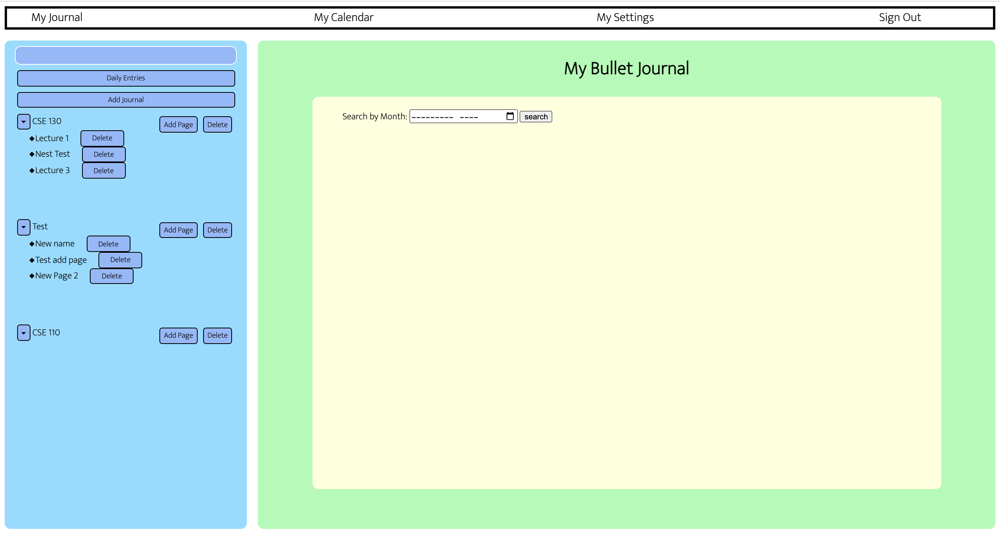

There is a navigation bar at the top of the page with four buttons **My Journal**, **My Calendar**, **My Settings** and **Sign Out**.
  

### 2. **My Journal**

2.1 Concepts of Journals and Pages

Users can add bullet entries under **My Journal** page, and there are two main options: journals and pages.

Journal is a broad management approach. It doesn't need details about the content, but clear structure to navigate files efficiently.

Page then can be added under the journal it belongs to. It includes more information about the journal entry users want to keep track of.
  

2.2 Add/ View/ Delete a Journal

To add a new journal, click **Add Journal** on the left and type in the journal name inside flesh color box. Click add and the new journals is shown on the left.

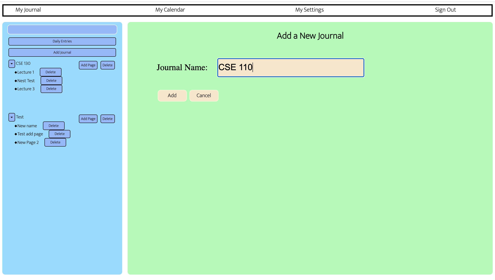

To view an existing journal, click that journal and users will see all names of pages it contains on the right.

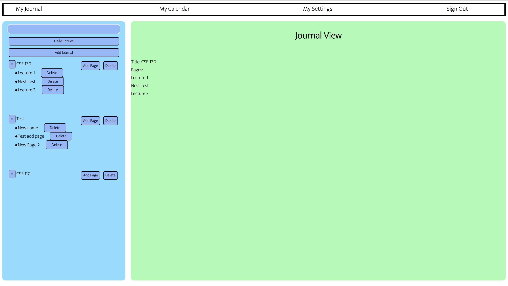

To delete an existing journal, click **Delete** button beside the journal users want to delete.
  

2.3 Add/ View/ Delete a Page

To add a new page, first decide which journal it belongs to. Then, click the **Add Page** button beside that journal, users will see a input form on the left. They can only check if they are at the right journal from the Journal Title (The example shows "CSE 130", meaning that they are at CSE 130 Journal.)

Fill in the Page Title and add any notes into Content. Click **Add** to add the page.

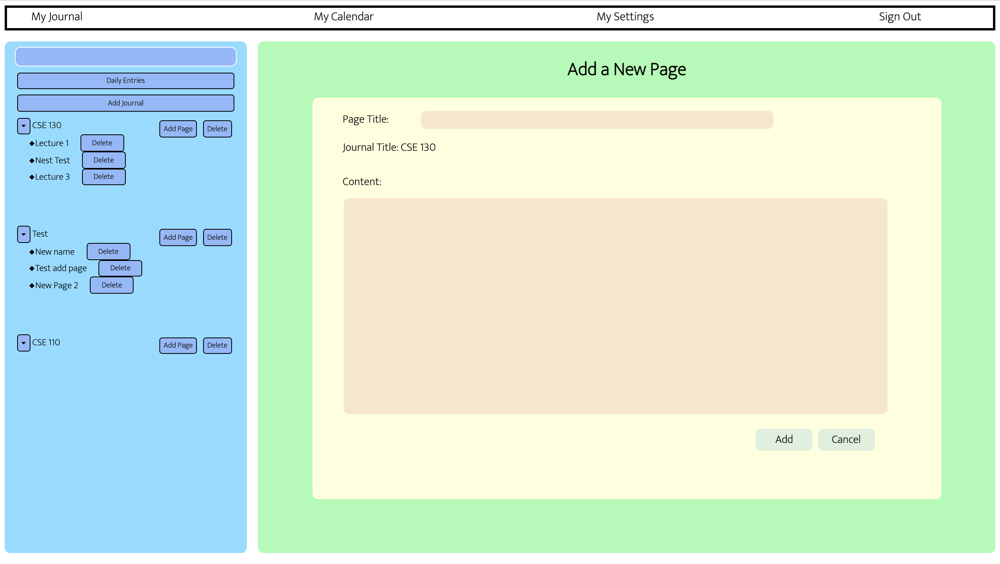

To view an existing page, click the name of the page on the left. Users will see the page content on the right.

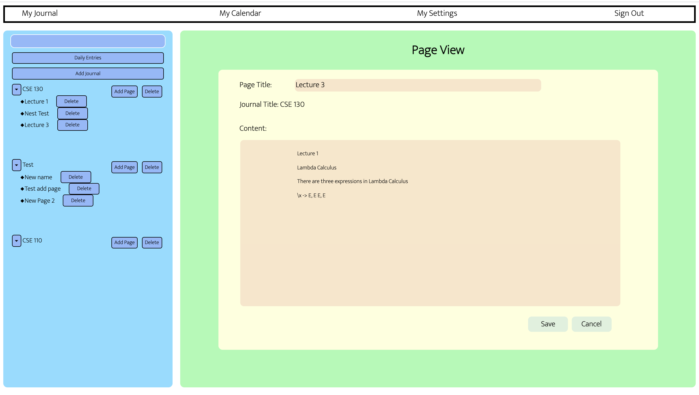

To delete an existing page, click the **Delete** button on the right of that page.

  

### 3. **My Calendar**

3.1 Monthly View

On **My Calendar** Page, users would see a monthly calendar where they can go to different months by toggling the triangles button besides its title.

Each grid has a number at the top left that corresponds to the date it represents. Today's grid is highlighted, while grids containing the daily entries are filled with blue. The titles of daily entries are also attached to the grids.

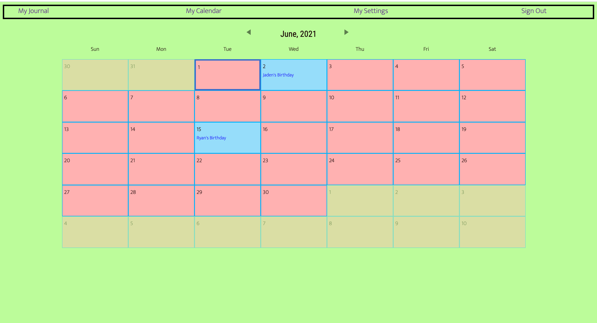

  

3.2 Add a New Daily Entry

To add a daily entry, users should first decide which date the entry is going to add on. 

Users should first click the selection box and select the year and month. 

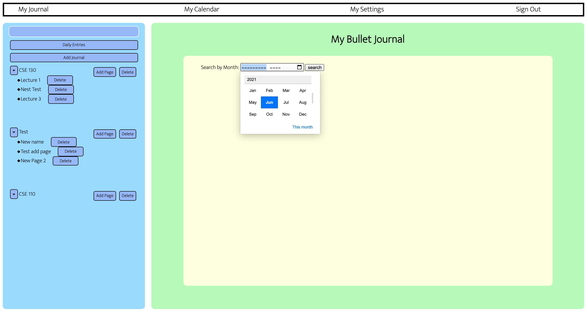

After clicking **Search** button on the right, a list of dates in that year and that month would be displayed on the page. Users can then scroll down to the date and click **Add** button on the right to add a new daily entry.

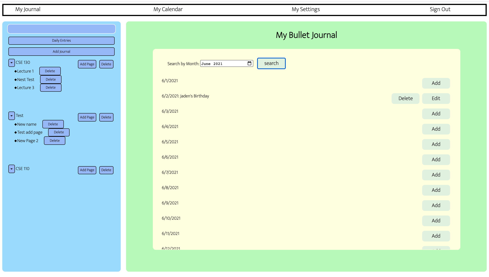

  

3.3 View/ Edit/ Delete Daily Entry

To view an existing daily entry, click **Edit** button besides the date of that daily entry.

Users could edit the daily entry and click **Save** button to save their updates.

To delete a daily entry, click **Delete** button and users should see it changes back to **Add** button, which means there is no daily entry at that date anymore.

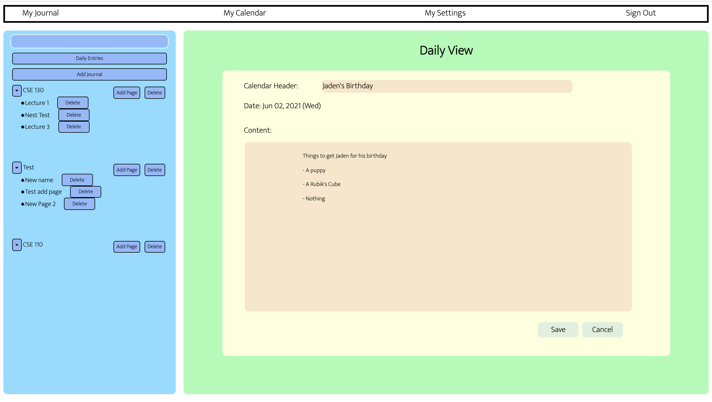

  

### 4. **My Settings**

Under **My Settings** page, Users can customize the font size. PPG also provides light mode (default) and dark mode (only black and white).
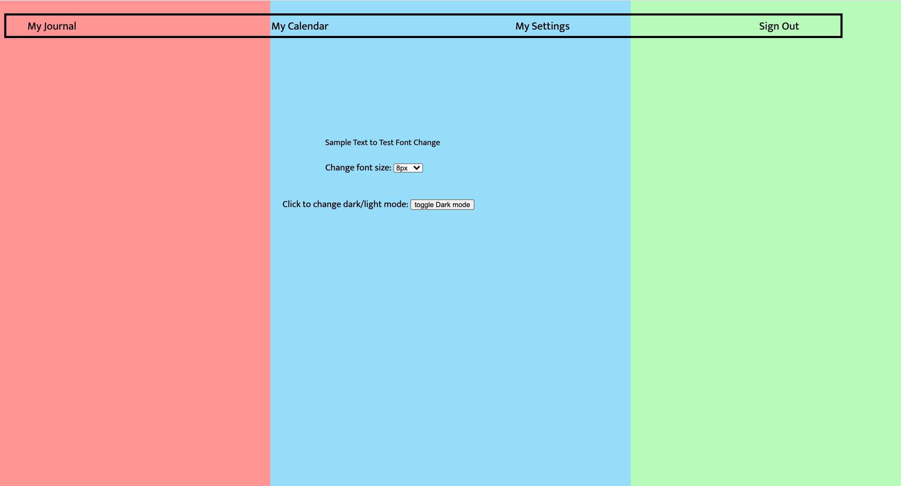
  

### 5. **Sign Out**

Users can click the **Sign Out** button far right on the navigation bar to log out the PPG.